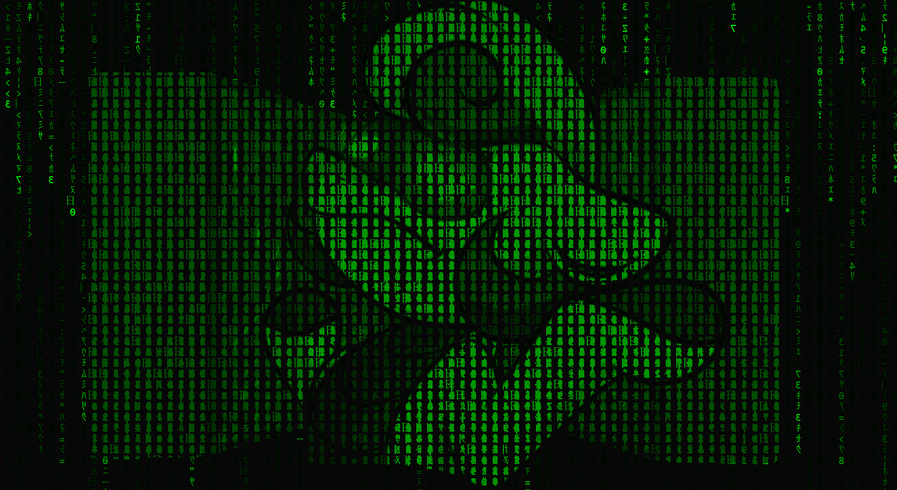

Gradually fills in a Matrix effect over a background image.

Set up a canvas on a page, import Matrix from matrix.js, and instantiate it:

```javascript
new Matrix({
	canvas: document.getElementById('canvas'),
	imageUrl: "./annie_green.png", // Be careful to avoid CORS errors
	fullscreen: true, // Sets canvas width and height to window width and height
	invert: true // Draws the text backwards but keeps the image the same, for accuracy to the movie
});
```

Annie Vorchine credit [@jasminDreasond](/jasminDreasond): https://derpibooru.org/search?q=oc%3Aannie%20vorechine
